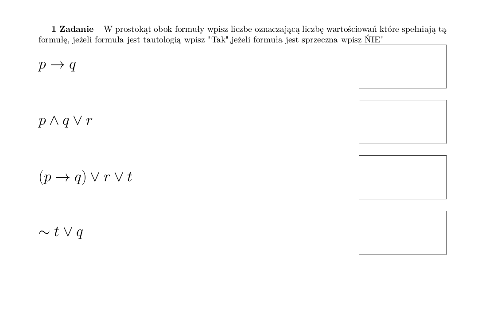
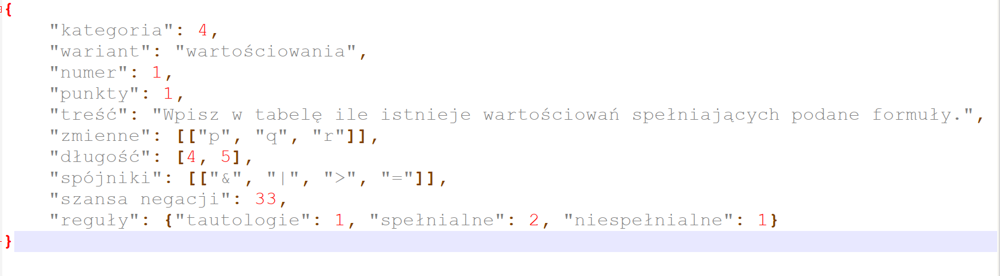
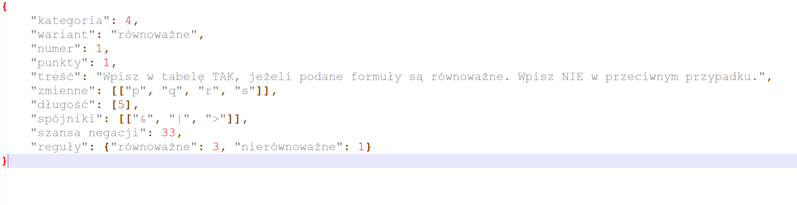

# PWI projekt 8 - Generator zadań z Logiki dla informatyków

#### Program generuje 4 różne typy zadań z Logiki w formie pdf i unicode. Użytkownik podaje ścieżkę do pliku .json, który definuje jaki typ zadania ma zostać wygenerowany, następnie podaje folder, w którym zadania mają zostać wygenerowane, oraz ich ilość.


## Wymagania
Napisany i testowany na Python 3.8.5.

#### Pakiety
* pylatex
```bash
pip3 install pylatex
```

* sympy
```bash
pip3 install sympy
```

* pyparsing
```bash
pip3 install pyparsing
```

#### Biblioteki
* os
* random
* unicodeit
```bash
pip3 install unicodeit
```
* json

## Jak używać?
#### 1. Uruchomić plik generator.py 
co dalej?

## Opis typów
### Typ 1

### Typ 2
Generuje zadanie z podpunktami. Losowo wybiera treść i jeden z jej podpunktów, a następnie tworzy całe zadanie.
Przykład:

__screen do wstawienia__

Zasady wpisywania do pliku .json:

Każde zadanie posiada 'treść' oraz 'podpunkty'. Zasady wpisywania takie jak w latexu, z tym, że \ trzeba zastąpić \\.
Wyrażenia matematyczne zapisuje się pomiędzy _$ $_. Otwierający _$_ musi przylegać do pierwszego słowa wyrażenia, a zamykający _$_ do ostatniego.

### Typ 3

### Typ 4

## Opis
Zadania typu-4, to rodzaje zadań oparte na formułach logicznych.
Aktualnie obsługiwane są dwa warianty zadań, równoważność i wartościowania.
Program pobiera informacje o zadaniu z pliku json, a następnie na jego podstawie
generuje wybraną ilość pakietów zadań, gdzie każde zadanie ma 4 podpunkty.

## Przykład pdf-a


## Json, konstrukcja
Konstrukcja pliku json jest następująca




lub

    

### Objaśnienia

Kategoria- typ zadania, w tym wypadku jest to oczywiście typ 4.    
  
Wariant- wariant zadania typu 4, dozwolone wartości to "wartościowania" i "równoważność".   
   
Numer- numer zadania.  
  
Punkty- punkty możliwe do zdobycia za zadanie  
  
Treść- Treść zadania.  
  
Zmienne- dozwolone zmienne zdaniowe, których może użyć program.    
  
Długości- dozwolone długości formuł zdaniowych.  
    
Spójniki- spójniki, których użycie jest dozwolone przy budowaniu formuł,zbiór tych spójników nie powinien zawierać negacji
gdyż jest ona obsługiwana w inny sposób. Dozwolone spójniki to "|"-alternatywa,"&"-koniunkcja,">"-implikacja,"="-równoważność. 
     
Szansa negacji - podczas generowaniu formuł program w niektórych miejscach będzie musiał podjąć decyzję, czy zanegować jakąś część
formuły lub zmienną, szansa negacji określa w procentach szansę na zanegowanie formuły lub zmiennej.  
  
Reguły- to wytyczne którymi ma się kierować program przy generowaniu formuł, w przypadku wariantu "wartościowania" reguły to:
"tautologie", "spełnialne", "niespełnialne", a w przypadku wariantu "równoważność": "równoważne", "nierównoważne". 
